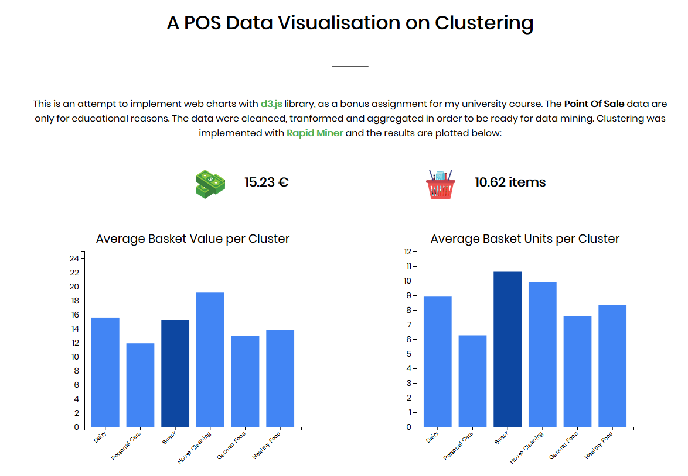

# Point of Sale data visualisation on Clustering Analysis

Find the results on [www.ionpeto.com/pos-vis](www.ionpeto.com/pos-vis)

This project is about getting familiar with [d3.js](https://d3js.org) library on educational POS Data. Data Mining was done using [Rapid Miner](https://rapidminer.com/) and Data Cleaning and Transforming technics were implementing using [Python Pandas](https://pandas.pydata.org/) library.

<i> The project was a Bonus Assignment for my University Course "Business Analytics and Personalization Technologies" under the supervision of prof. G. Lekakos and prof. K. Pramatari. </i>